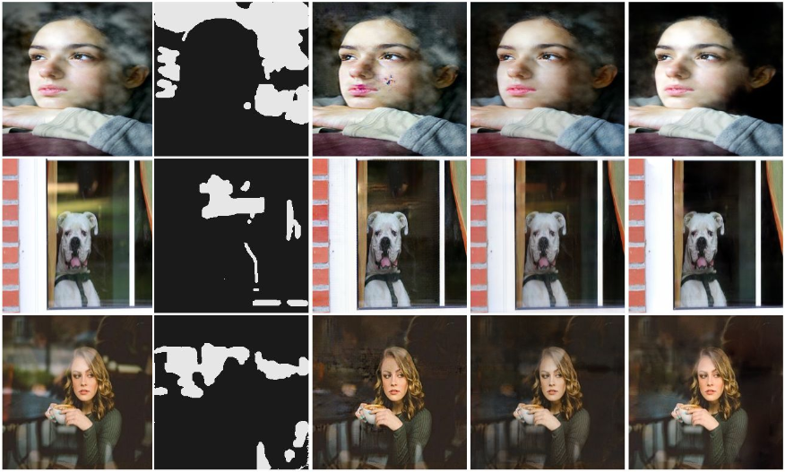

# Reflection-Removal-Manual-Annotation
Implementation of paper "Single Image Reflection Removal Based on Manual Annotation"

We propose a deep learning model that can interactively remove image reflection based on manual annotation. The model can obtain guidance information from the attention map annotated by a user to effectively learn the function mapping of the image from reflective to non-reflective. We have launched extensive comparative experiments and validations on open source datasets, which fully indicates that the model performs well on image similarity indicators such as PSNR and SSIM, when the accuracy of image annotations by a user is roughly realized. In addition, for the non-reflective part within a user annotated area, the model can ignore its influence to some extent.

The result of our model on some of the CEILNET datasets is demonstrated below.

## Setup

#### Prerequisites
 * Python 3.5
 * Tensorflow 1.12
 * NVIDIA GPU + CUDA CuDNN (CUDA 8.0)

#### Installation:
 * Clone/Download this repo
 * `$ cd perceptual-reflection-removal`
 
## Dataset
We used dataset from [@ceciliavision/perceptual-reflection-removal](https://github.com/ceciliavision/perceptual-reflection-removal.git), you can also download it from [here](https://drive.google.com/drive/folders/1NYGL3wQ2pRkwfLMcV2zxXDV8JRSoVxwA?usp=sharing). 

You can also use your own dataset, but make sure your folder is as follows:
>+-- `root_training_synthetic_data` 
>>+-- `reflection_layer` 
>>+-- `transmission_layer` 

>+-- `root_training_real_data` 
>>+-- `blended` 
>>+-- `transmission_layer` 

##Trian
`$ python3 test_model.py --train_dataset your_train_data_path`

You can view or modify the config in cfg.py.

##Test
Download our pre-trained model from [here](https://pan.baidu.com/s/10wbwCN2DXNJ8LFsHLK_rmA)(the key is `c0mk`)
Run 
`$ python3 test_model.py --val_dataset your_test_data_path`

##Demo
If you want to use our interaction demo, run `main.py`.
